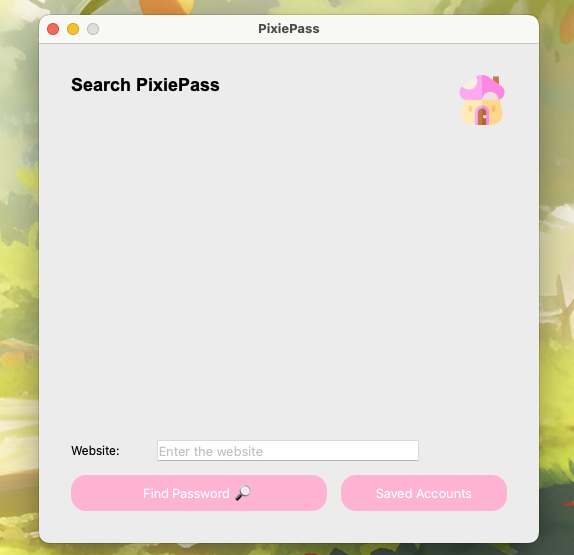

# PixiePass: A Whimsical and Secure Password Manager

PixiePass is a simple yet secure GUI password manager designed exclusively for Mac users. It offers a delightful, whimsical interface that stands apart from conventional password managers, making your experience both functional and fun.

## Features

### 🧚 Whimsical and Cute Design
PixiePass transforms password management into an enjoyable experience with its charming and user-friendly interface.

### 🔒 Robust Security
- All passwords are encrypted to ensure your sensitive information remains secure.
- The encryption process guarantees that your data is protected against unauthorized access.

### 🛠️ Comprehensive Functionality
- **Add Passwords:** Store your passwords with ease.
- **Lookup Passwords:** Quickly retrieve stored credentials.
- **Delete Passwords:** Remove outdated or unnecessary entries.
- **Generate Passwords:** Create strong, secure passwords effortlessly.

### 📊 SQLite Integration
PixiePass uses SQLite as its database, providing a lightweight and efficient way to manage your data securely.

### 📢 User Notifications
PixiePass includes intuitive pop-ups to enhance the user experience:
- **Error Handling:** Alerts for missing fields or inability to locate passwords.
- **Success Messages:** Notifications for actions like successfully adding or editing passwords.

### 🖥️ Built with PySide6
PixiePass is developed using PySide6, ensuring a modern and responsive graphical user interface.

## Contribute
PixiePass is currently a portfolio project. While it is not intended for professional use, feedback and suggestions are always welcome!

## Screenshots
Here’s a sneak peek of PixiePass in action! 📸

### Main Screen

*A whimsical and intuitive home screen to navigate through PixiePass features.*

### Add Password Screen

*Simple form for adding secure passwords with ease.*

### Search Screen

*Simple form for adding secure passwords with ease.*

### Pop-Ups
#### Missing Fields

*Helpful feedback pop-ups for errors and successful actions.*

